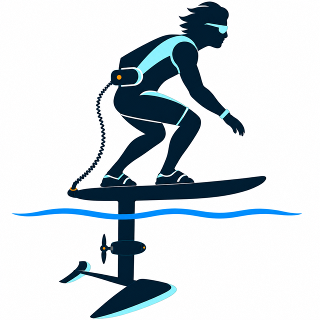

<p align="center">
  
</p>

<h1 align="center">Jarred Drive</h1>

<p align="center"><strong>A local-first flight recorder and engineering cockpit for a DIY lumbar-mounted foil-assist.</strong></p>

<p align="center">Launch analysis · ride dynamics · thermal forensics · system health · verified offline sync</p>


Jarred Drive turns each session into evidence for improving the rider and the machine. A read-only ESP32
instrument records propulsion, temperature, motion, water, logger-health, and optional GNSS observations;
the desktop dashboard reconstructs launches, foil runs, turns, touchdowns, falls, crashes, thermal behavior,
and configuration outcomes after the ride.

> **Safety boundary:** VESC controls propulsion and the VX3 controls the VESC. Jarred Drive observes and
> records. The ESP32 is never required for throttle or failsafe behavior, and this version contains no VESC
> write path.

## Physical system

The intended propulsion layout is part of the design contract:

- The battery is worn in a **lumbar-mounted pack**.
- A short, flexible **coiled umbilical runs from the lumbar pack to a connector at the rear of the board**.
- The compact electric **motor pod and exposed propeller sit on the mast about one-third of the way down from
  the board**.
- The hydrofoil wing remains at the bottom of the mast.
- No exposed cable is intended to hang from the board down the mast in the product silhouette.

The system uses a 12S3P battery assembled from six 6S1P packs, a Flipsky 75200 Pro V2.0 VESC, Flipsky
6384 140KV motor, VX3 remote/receiver, Waveshare ESP32-S3-LCD-1.47B, QMI8658 IMU, seven NTC channels,
a water-presence probe, microSD logging, and an isolated 5.1 V instrument supply. See
[architecture.md](docs/architecture.md) for signal and power boundaries and
[hardware_validation.md](docs/hardware_validation.md) before connecting real hardware.

## Dashboard workspaces

| Workspace | Questions it answers |
|---|---|
| Devices / Sync | Is the logger ready, and did every file arrive intact? |
| Flight Deck | What happened across the whole session? |
| Launch Lab | How much power produced takeoff, and why did attempts fail? |
| Ride Dynamics | How stable were foil runs, turns, recoveries, falls, and crashes? |
| Thermal Lab | Where and when did heat accumulate—especially during starts? |
| System Health | Did voltage, current, temperatures, sensors, and logging stay credible? |
| Tuning | Which immutable VESC/configuration snapshot produced this result? |
| Progress | Are rider outcomes and machine efficiency improving across sessions? |
| Annotate | What should a human correct for future detector development? |
| Raw Data | What did the logger actually record, and did it satisfy the schema? |

The interface is fully local and uses offline-safe artwork, SVG analytical plots, a meter-scale GPS route,
session provenance, and explicit synthetic/field labeling. It does not depend on cloud map tiles or analytics
services.

## What is implemented

- Versioned 10 Hz telemetry for VESC values, six pack temperatures, enclosure temperature, water sensing,
  QMI8658 motion, health flags, and optional GNSS.
- Deterministic coupled simulation with realistic route geometry, turns, launch-to-foil transitions, aborted
  starts, crashes, recoveries, voltage sag, heating, GNSS dropout, and logger degradation.
- Four development scenarios: a single-parameter commissioning pair, Pack 4 thermal anomaly, and latched
  water-ingress/VESC-fault drill.
- Derived launch attempts and aligned power curves, rides, crash windows, electrical/thermal phase summaries,
  turn dynamics, session summaries, and progression metrics.
- Home-LAN logger manifests, resumable downloads, SHA-256 verification, duplicate-safe import, immutable raw
  storage, QA reports, and DuckDB/Parquet processing.
- Manual annotations stored separately from raw observations and merged with provenance.
- PlatformIO firmware for Waveshare ESP32-S3-LCD-1.47B plus host-native safety-policy tests.
- A native SwiftUI iPhone prototype that pulls the same immutable sessions from either the ESP or a Mac-hosted
  synthetic logger, verifies hashes, presents a compact ride/health summary, and exports a read-only analysis
  handoff for ChatGPT mobile.

Synthetic results prove software workflows, not real hardware behavior, classifier accuracy, safe thermal
limits, or on-water performance. Definitions and inference limits live in [analytics.md](docs/analytics.md).

## Quick start

Prerequisites: pyenv, Python 3.12.6, Poetry 1.8+, and a terminal.

```bash
pyenv install -s 3.12.6
pyenv local 3.12.6
poetry env use "$(pyenv which python)"
poetry install
make demo
make check
make dashboard
```

The launcher checks localhost ports beginning at `8501`, chooses the first free port, and prints the exact
URL. To start the scan elsewhere:

```bash
JARRED_DRIVE_PORT_START=8600 make dashboard
```

## Data lifecycle

```text
ESP32 microSD (source of truth)
    -> explicit home-only SYNC mode
    -> resumable download + SHA-256 verification
    -> immutable data/raw/<device>/<session>/
    -> schema QA + derived events/rides/analysis
    -> replaceable DuckDB/Parquet in data/processed/
    -> local Streamlit dashboard
```

The app never automatically deletes logger data. Tokens are entered at runtime and are not stored. Raw
sessions, processed outputs, and annotations are ignored by Git; deterministic demo fixtures are committed.
See [synchronization.md](docs/synchronization.md) and [data_contract.md](docs/data_contract.md).

## Common commands

```bash
# Validate a logger export
poetry run jarred-drive validate-log path/to/telemetry.csv

# Rebuild the full derived analysis package
poetry run jarred-drive summarize path/to/telemetry.csv --output analysis.json

# Register the matching read-only VESC Tool snapshot
poetry run jarred-drive register-config path/to/FOIL_012.json

# Exercise verified sync against the synthetic logger
poetry run jarred-drive sync --url demo

# Emulate the ESP API for the iOS Simulator
make demo-server

# Emulate it for an iPhone on the same trusted Wi-Fi (use the Mac's LAN IP in the app)
poetry run jarred-drive serve-demo --source data/demo --host 0.0.0.0 --port 8765

# Sync physical logger after explicitly enabling SYNC mode
poetry run jarred-drive sync --url http://jarred-drive.local --token YOUR_LOCAL_DEVICE_TOKEN

# Compile firmware without flashing hardware
make firmware-hardware
```

## GNSS status

The schema, simulator, analysis, and dashboard support GPS. The selected VESC and Waveshare board do not
contain a GNSS receiver, so field tracks require a separate 3.3 V UART NMEA module. Phase 2 reserves ESP
GPIO2/GPIO3 for it; that hardware and its antenna placement still require validation.

## Documentation

- [System architecture](docs/architecture.md) — component, signal, runtime, and propulsion boundaries
- [Analytics catalog](docs/analytics.md) — metrics, event definitions, and inference limits
- [Telemetry data contract](docs/data_contract.md) — fields, units, validity, and compatibility
- [Synchronization](docs/synchronization.md) — device states, protocol, integrity, and storage
- [Safety case](docs/safety.md) — non-negotiable control isolation and stop conditions
- [Hardware validation](docs/hardware_validation.md) — bench, fault, enclosure, and on-water gates
- [Development](docs/development.md) — environment, checks, privacy, and repository identity
- [Brand system](docs/brand.md) — mark meaning, geometry, palette, and asset usage
- [Reference projects](docs/references.md) — prior art used as inspiration
- [Validation report](docs/validation_report.md) — reproducible evidence and remaining gates

## Current boundary

The application, simulator, analysis pipeline, sync implementation, and firmware build are development-ready.
The physical system is not yet field-validated. Before powered or on-water operation, complete every gate in
[hardware_validation.md](docs/hardware_validation.md), including pin confirmation, sensor calibration,
read-only UART verification, fault injection, waterproofing, strain relief, EMI testing, the lumbar-to-board
coiled lead, the mast-mounted propeller drive, and validation against real labeled sessions.
